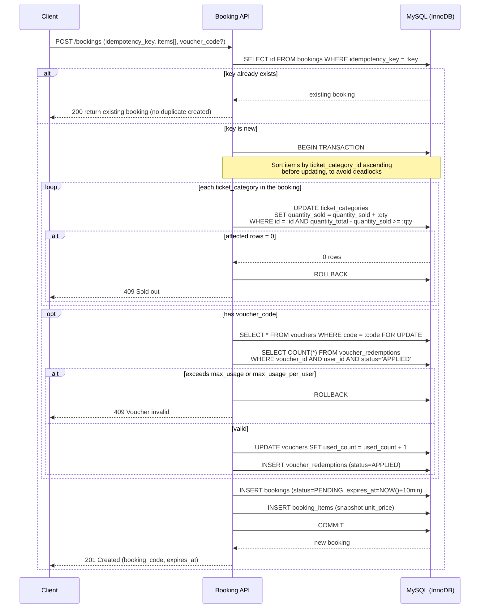
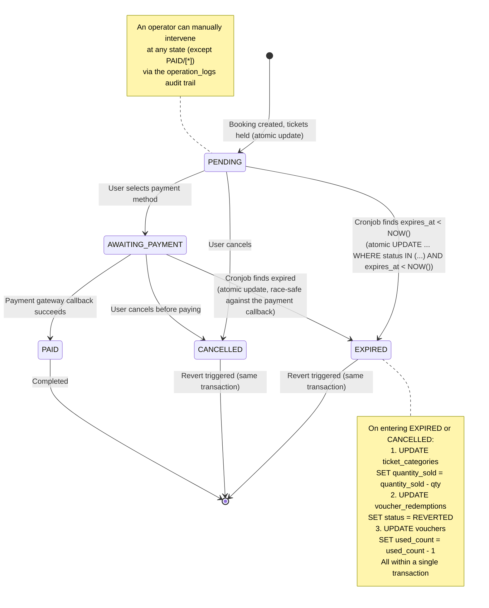

# Concert Ticket Booking Platform — Backend

Product Backend Engineer technical assessment (GEEK Up). A backend system for a concert
ticket booking platform, covering two API groups: customer-facing (booking flow) and an
internal operation dashboard.

## 1. Overall Architecture

```
┌─────────────┐         ┌─────────────┐         ┌─────────────┐
│   Customer  │         │  Operation  │         │  Scheduled  │
│   Client    │         │  Dashboard  │         │     Job     │
└──────┬──────┘         └──────┬──────┘         └──────┬──────┘
       │                       │                       │
       └───────────────────────┼───────────────────────┘
                                │
                    ┌───────────▼───────────┐
                    │   Spring Boot App     │
                    │  ┌──────────────────┐ │
                    │  │   Controller     │ │
                    │  ├──────────────────┤ │
                    │  │   Service        │ │  <- business logic,
                    │  │   (Booking,      │ │     transaction boundary
                    │  │   Voucher,       │ │
                    │  │   Concert)       │ │
                    │  ├──────────────────┤ │
                    │  │   Repository     │ │  <- JPA + native query
                    │  │   (JPA)          │ │     for the atomic-update parts
                    │  └──────────────────┘ │
                    └───────────┬───────────┘
                                │
                    ┌───────────▼───────────┐
                    │   MySQL 8.0 (InnoDB)  │
                    └───────────────────────┘
```

A simple monolith, no microservices split — the expected scale (50k users, 300-500
requests/minute) doesn't justify service decomposition. Splitting it would be over-engineering
and would take time away from what actually matters here: correct concurrency handling.

## 2. Tech Stack

| Component | Choice                                                  | Reason                                                                                                  |
| --------- | ------------------------------------------------------- | ------------------------------------------------------------------------------------------------------- |
| Language  | Java 17+                                                | LTS, required minimum for Spring Boot 4.0.7                                                             |
| Framework | Spring Boot 4.0.7                                       | Core stack, sufficient ecosystem for this scope                                                         |
| Database  | MySQL 8.0 (InnoDB)                                      | InnoDB's row-level locking is the foundation for the atomic-update approach that prevents overselling   |
| ORM       | Spring Data JPA + native query where needed             | JPA for standard CRUD, native/JPQL update for anything requiring atomicity                              |
| Migration | Flyway                                                  | Schema versioning, easy local re-setup                                                                  |
| API Docs  | springdoc-openapi (Swagger UI)                          | Required by the assessment                                                                              |
| Testing   | JUnit 5 + Mockito (unit) + Testcontainers (integration) | Testcontainers to test real concurrency against a real MySQL instance — race conditions can't be mocked |

## 3. How the 4 Core Problems Are Solved

### 3.1. Overselling tickets

An atomic UPDATE with a WHERE condition in a single SQL statement, relying on InnoDB's
default row-level locking — not optimistic locking (a version column), because a flash
sale is a high-contention scenario and optimistic locking would create a retry storm
that hammers the DB right when it's already under the most pressure.

```sql
UPDATE ticket_categories
SET quantity_sold = quantity_sold + :qty
WHERE id = :id AND (quantity_total - quantity_sold) >= :qty;
```

0 affected rows = sold out, fail immediately, no automatic retry.

### 3.2. Duplicate bookings from retries

The client generates an `idempotencyKey` (UUID) and sends it with every booking-creation
request. The server enforces a DB-level unique constraint (`bookings.idempotency_key`) —
if the key already exists, the existing booking is returned instead of creating a new one.

### 3.3. Voucher abuse

A dedicated `voucher_redemptions` table tracks who has used which voucher, combined with a
pessimistic lock (`SELECT ... FOR UPDATE`) on the voucher row during application — because
validity depends on checking across two tables (system-wide used_count on vouchers, and a
specific user's usage count in redemptions), a plain atomic update isn't sufficient here;
an explicit transaction lock is needed.

### 3.4. Stability under traffic spikes

- Proper indexing (`idx_cronjob_scan`, `idx_status_created`) avoids full table scans
- Short transactions, minimal lock duration (only lock the exact row needed, never the
  whole table)
- Connection pool (HikariCP, Spring Boot default) tuned via `maximum-pool-size` for the
  expected load — configuration details in `application.yml`

### 3.5. Booking Creation Flow (end-to-end)



## 4. Booking Lifecycle



On entering EXPIRED/CANCELLED: revert the ticket hold + revert the voucher + decrement
used_count, all atomically within a single transaction.

## 5. Directory Structure

```
src/main/java/com/geekup/ticketbooking/
├── controller/
│   ├── customer/        # customer-facing APIs (booking, concert browsing)
│   └── operation/       # operation dashboard APIs
├── service/
├── repository/
├── entity/
├── dto/
│   ├── request/
│   └── response/
├── exception/
├── config/              # SecurityConfig, SwaggerConfig, SchedulerConfig...
└── scheduler/           # @Scheduled jobs
```

## 6. Local Setup & Run

### Prerequisites

- Java 17+
- Maven (or use the included `./mvnw` wrapper)
- Docker & Docker Compose

### Steps

```bash
# 1. Start MySQL via Docker Compose
cd backend
docker-compose up -d

# Wait until MySQL is healthy (~15-30s), then verify:
docker-compose ps   # STATUS should show "healthy"

# 2. Run the app (Flyway migrations run automatically on startup)
./mvnw spring-boot:run -Dspring-boot.run.profiles=local

# 3. Swagger UI
http://localhost:8080/swagger-ui.html

# 4. Run unit tests (no Docker required)
./mvnw test

# 5. Run integration tests (requires Docker — Testcontainers spins up a MySQL container)
./mvnw verify
```

### Credentials (local only — never use in production)

| Config key       | Value              |
|------------------|--------------------|
| DB host          | `localhost:3306`   |
| DB name          | `concert_booking`  |
| DB user          | `appuser`          |
| DB password      | `apppassword`      |
| Root password    | `rootpassword`     |

### Verify migrations ran correctly

```sql
-- Should return 8 tables
SELECT table_name FROM information_schema.tables
WHERE table_schema = 'concert_booking'
ORDER BY table_name;

-- Should return 4 users, 3 concerts, 5 ticket categories, 6 vouchers
SELECT 'users' AS t, COUNT(*) FROM users
UNION ALL SELECT 'concerts', COUNT(*) FROM concerts
UNION ALL SELECT 'ticket_categories', COUNT(*) FROM ticket_categories
UNION ALL SELECT 'vouchers', COUNT(*) FROM vouchers;
```

## 7. Related Documents

- `schema.sql` — full DDL, commented with the reasoning behind each design decision
- `AGENTS.md` — coding convention rules (written for AI agents, but useful for humans too)
- `ASSUMPTIONS.md` — system assumptions & limitations (filled in during Phase 8)
- `docs/api-collection.postman_collection.json` — Postman collection for API testing

## 8. Known Limitations (full detail in ASSUMPTIONS.md)

- No full authentication/authorization (a simplified JWT stand-in, not production-grade
  security) — outside the assessment's scope
- No full voucher CRUD API — only seeded data + validate/apply, matching the scope
  guidance given in the assessment
- No microservices split, no message queue — the expected traffic (300-500 req/minute)
  doesn't require it; DB-level locking is sufficient and easier to explain
